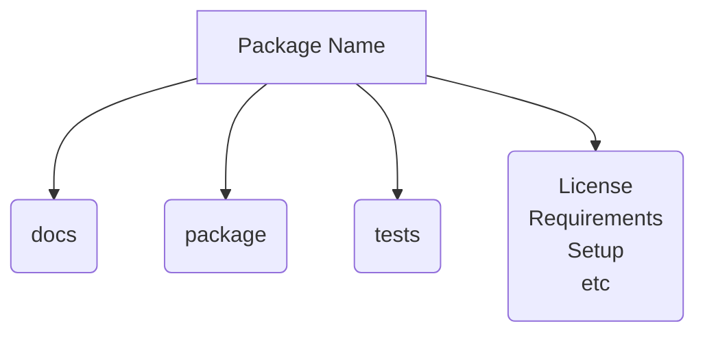
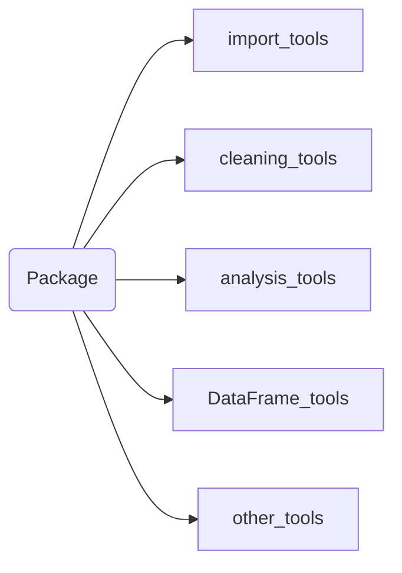
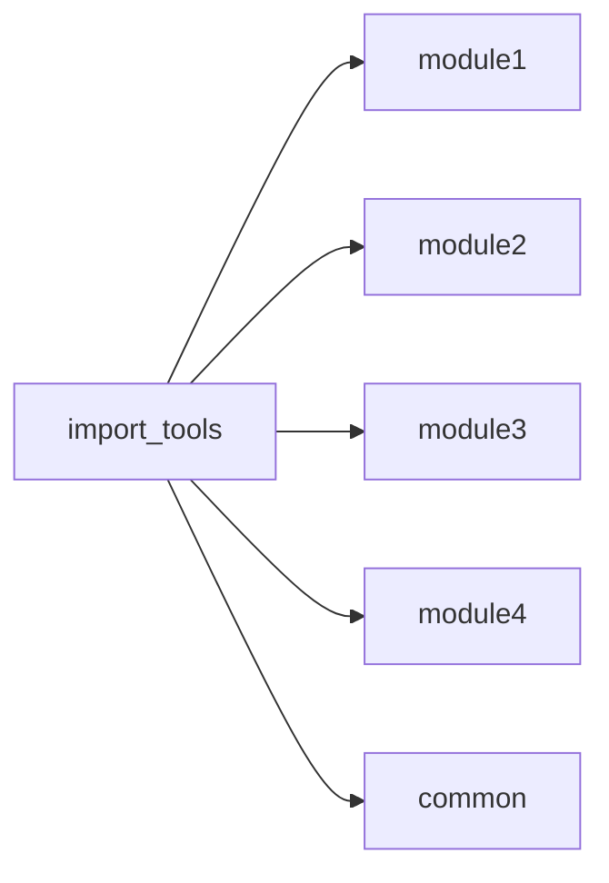
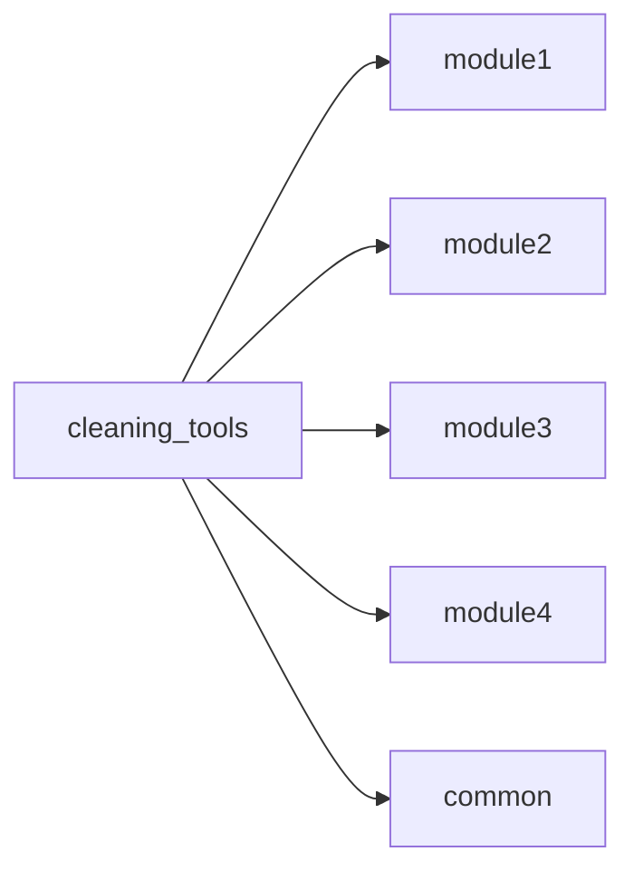
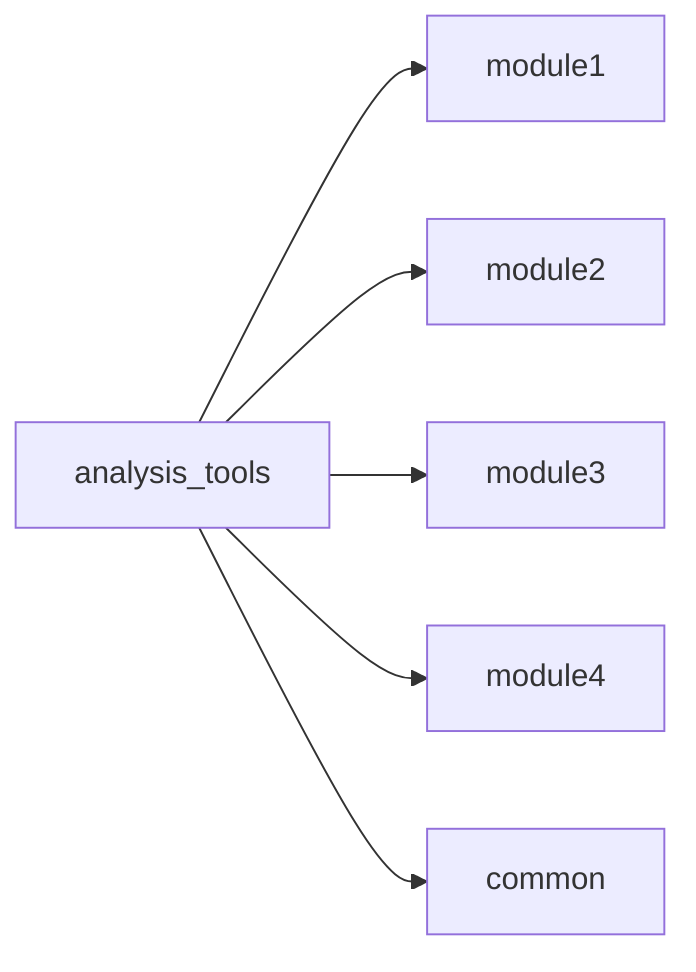
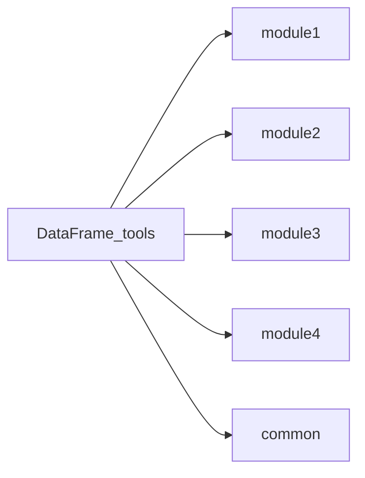
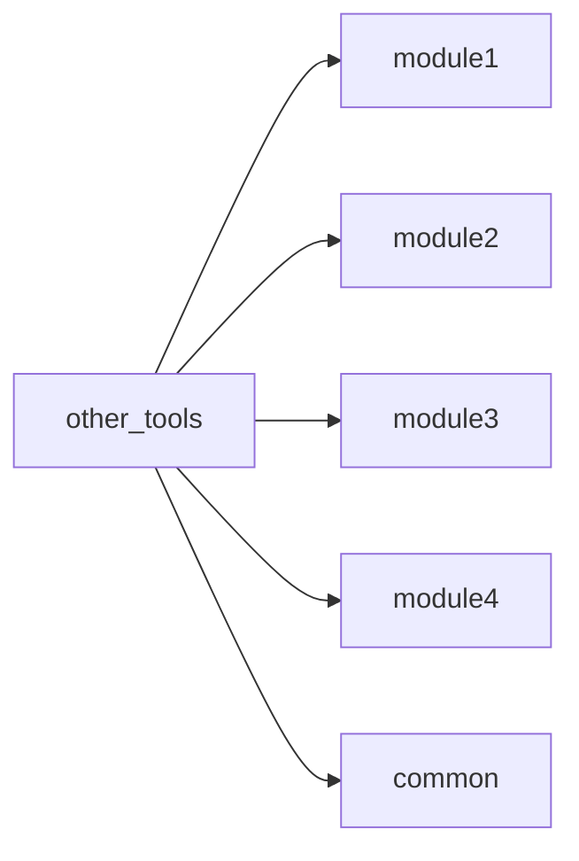

# Project structure

```mermaid
graph TD
    A1[Package Name] --> B1(docs)
    A1 --> C1(package)
    A1 --> D1(tests)
    A1 --> E1(License<br>Requirements<br>Setup<br>etc)
```

# Package

```mermaid
graph LR
    C1(Package) --> P1[import_tools]
    C1 -->P2[cleaning_tools]
    C1 --> P3[analysis_tools]
    C1 --> p4[DataFrame_tools]
    C1 --> p5[other_tools]
   
```

## Import tools

```mermaid
graph LR
    P1[import_tools] --> p1.1[module1]
    P1 --> p1.2[module2]
    P1 --> p1.3[module3]
    P1 --> p1.4[module4]
    P1 --> p1.5[common]
```

## Cleaning tools

```mermaid
graph LR
    L1[cleaning_tools] --> l1.1[module1]
    L1 --> l1.2[module2]
    L1 --> l1.3[module3]
    L1 --> l1.4[module4]
    L1 --> l1.5[common]
```

## Analysis tools

```mermaid
graph LR
    L1[analysis_tools] --> l1.1[module1]
    L1 --> l1.2[module2]
    L1 --> l1.3[module3]
    L1 --> l1.4[module4]
    L1 --> l1.5[common]
```

## DataFrame tools

```mermaid
graph LR
    L1[DataFrame_tools] --> l1.1[module1]
    L1 --> l1.2[module2]
    L1 --> l1.3[module3]
    L1 --> l1.4[module4]
    L1 --> l1.5[common]
```

## Other tools

```mermaid
graph LR
    L1[other_tools] --> l1.1[module1]
    L1 --> l1.2[module2]
    L1 --> l1.3[module3]
    L1 --> l1.4[module4]
    L1 --> l1.5[common]
```
