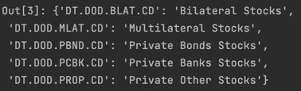
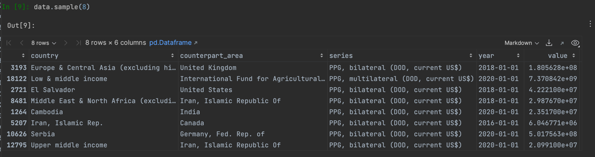

# bblocks Import Tools

**bblocks** import tools are a set of tools that allow you to import data from various sources. In general,
these tools handle getting the data from the source and structuring it into a DataFrame that can be used
for further analysis.

Using the import tools is quite simple. Using the `world_bank` importer as an example:

```python
# Import the importer
from bblocks.import_tools.world_bank import WorldBankData

# Set a path to save the data to
from bblocks import set_bblocks_data_path

set_bblocks_data_path('~/bblocks_data')

# Create an instance of the importer. We'll call it `world_bank` for this example.
world_bank = WorldBankData()

# Now we'll load an indicator from the World Bank World Development Indicators
world_bank.load_data(indicator='NY.GDP.MKTP.CD')  # This is GDP in current prices

# We can now access the data as a DataFrame
data = world_bank.get_data()
```

The DataFrame will have this structure:


Bblocks currently supports the following importers:

- **[DebtIDS](#debtids)**: An importer to get data from the World Bank International Debt Statistics database.
- **get_fao_index**: A function to import the FAO Food Price Index.
- **HDR**: An importer to get the _UNDP Human Development Report_ data.
- **ILO**: An importer to get data from the International Labour Organization.
- **IMF**: An importer to get data from the International Monetary Fund World Economic Outlook.
- **SDR**: An importer to get data about Special Drawing Rights from the IMF website.
- **Aids**: An importer to get HIV/AIDS data from the UNAIDS website.
- **WFPData**: An importer to get _insufficient food_ and _inflation_ data from the World Food Programme.
- **GHED**: An importer to get data from the WHO Global Health Expenditure Database.
- **WorldBankData**: An importer to get data from the World Bank databases.

## Importers

### DebtIDS

DebtIDS is an importer class that allows you to get data from the World Bank International Debt
Statistics database.

To use it, it is always best practise to set a data path to store the downloaded data. This can be done
using the `set_bblocks_data_path` function:

```python
from bblocks import set_bblocks_data_path

# Set a path to save the data to. It can be any folder you want.
set_bblocks_data_path('~/bblocks_data')
```

Now we can import the DebtIDS importer and create an instance of it:

```python
from bblocks.import_tools.debt import DebtIDS

debt = DebtIDS()
```

#### DebtIDS().get_available_indicators()

If you are not sure about which indicators are available,
you can use the `get_available_indicators` method.

This method will return a dictionary of all available indicators.

```python
debt.get_available_indicators()
```


##### DebtIDS().debt_service_indicators(detailed_category: bool = True)

The DebtIDS importer also has a couple of methods to get the indicator codes
for **debt service** and debt stocks.

The `debt_service_indicators` method returns a dictionary of all available
debt service indicators. If `detailed_category` is set to `True`, the
dictionary will have the following structure:

```python
debt.debt_service_indicators(detailed_category=True)
```


Otherwise, the dictionary will just specify whether the indicator is
"bilateral", "multilateral" or "private" (all three PPG debt).

```python
debt.debt_service_indicators(detailed_category=False)
```


##### DebtIDS().debt_stocks_indicators(detailed_category: bool = True)

The DebtIDS importer also has a couple of methods to get the indicator codes
for **debt stocks** and debt service.

The `debt_stocks_indicators` method returns a dictionary of all available
debt stocks indicators. If `detailed_category` is set to `True`, the
dictionary will have the following structure:

```python
debt.debt_stocks_indicators(detailed_category=True)
```



Otherwise, the dictionary will just specify whether the indicator is
"bilateral", "multilateral" or "private" (all three PPG debt).

```python
debt.debt_stocks_indicators(detailed_category=False)
```


#### DebtIDS().load_data(indicators: str | list, start_year: int, end_year: int)

The `load_data` method the method to actually download the data.

The `indicators` argument can be a string or a list of strings. It accepts indicator codes.

The `start_year` and `end_year` arguments are integers that specify the start and end year of the data.
They must be provided.

In the background, the importer will download the data from the World Bank using the API.
The data will be saved in the data path specified earlier. The data is saved as `feather` files
in order to save create smaller files and to be able to quickly load the data.

Here's an example of how to use the `load_data` method.
We'll first start with importing the DebtIDS importer, setting a download path,
and then we'll download a couple of indicators.

```python
from bblocks.import_tools.debt import DebtIDS
from bblocks import set_bblocks_data_path

# Set a path to save the data to. It can be any folder you want.
set_bblocks_data_path('~/bblocks_data')

# Create an instance of the importer
debt = DebtIDS()

# Load the data for the desired indicators.
# If the data isn't already downloaded, it will be downloaded and saved.
debt.load_data(
    indicators=['DT.DOD.BLAT.CD', 'DT.DOD.MLAT.CD'],
    start_year=2015,
    end_year=2020
)
```

Running the code above loads the data into the `debt` object. If the data doesn't exist in the
folder that you've specified, it will be downloaded. If the data does exist there, it will be
loaded to the object without downloading it again.

If you've already downloaded the data, but you want to download it again, you can use the
`.update_data` method.

#### DebtIDS().update_data(reload_data: bool = True)

The `update_data` method allows you to update the data that you've already downloaded.

To use it, you first need to load one or more indicators using
the [load_data](#debtidsloaddataindicators-str--list-startyear-int-endyear-int) method.

Then you can use the `update_data` method to update the data.
By default, the method will reload the data into the object so you can use the updated version.

```python
from bblocks.import_tools.debt import DebtIDS
from bblocks import set_bblocks_data_path

# Set a path to save the data to. It can be any folder you want.
set_bblocks_data_path('~/bblocks_data')

# Create an instance of the importer
debt = DebtIDS()

# Load the data for the desired indicators.
# Assuming that it already exists in the folder, it won't be re-downloaded.
debt.load_data(
    indicators=['DT.DOD.BLAT.CD', 'DT.DOD.MLAT.CD'],
    start_year=2015,
    end_year=2020
)

# Update the data and reload it
debt.update_data(reload_data=True)
```

Running the code above downloads the data using the API, saves it to the folder,
and loads the data into the `debt` object.

To get the data as a DataFrame, you can use the `.get_data` method.

#### DebtIDS().get_data(indicators: str | list = "all")

The `get_data` method allows you to get the data as a DataFrame.

The `indicators` argument can be a string or a list of strings. It accepts indicator codes.

If you don't specify any indicators, or pass 'all', it will return a DataFrame with all the
indicators that you've loaded.

```python

from bblocks.import_tools.debt import DebtIDS
from bblocks import set_bblocks_data_path

# Set a path to save the data to. It can be any folder you want.
set_bblocks_data_path('~/bblocks_data')

# Create an instance of the importer
debt = DebtIDS()

# Load the data for the desired indicators.
debt.load_data(
    indicators=['DT.DOD.BLAT.CD', 'DT.DOD.MLAT.CD'],
    start_year=2015,
    end_year=2020
)

# Get the data as a DataFrame
data = debt.get_data(indicators='all')
```

Running the above code will return a DataFrame with the following structure:

