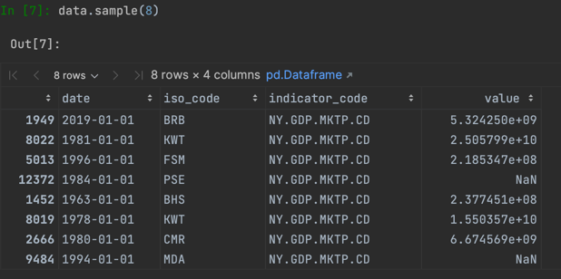
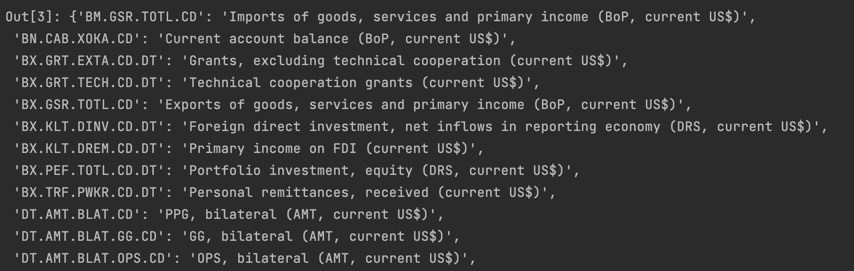
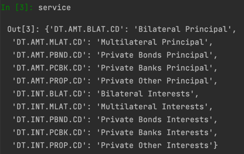
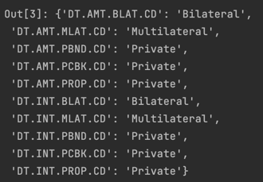
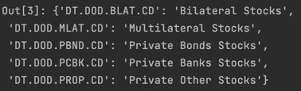
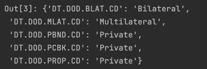

# bblocks Import Tools

**bblocks** import tools are a set of tools that allow you to import data from various sources. In general,
these tools handle getting the data from the source and structuring it into a DataFrame that can be used
for further analysis.

Using the import tools is quite simple. Using the `world_bank` importer as an example:

```python
# Import the importer
from bblocks.import_tools.world_bank import WorldBankData

# Set a path to save the data to
from bblocks import set_bblocks_data_path

set_bblocks_data_path('~/bblocks_data')

# Create an instance of the importer. We'll call it `world_bank` for this example.
world_bank = WorldBankData()

# Now we'll load an indicator from the World Bank World Development Indicators
world_bank.load_data(indicator='NY.GDP.MKTP.CD')  # This is GDP in current prices

# We can now access the data as a DataFrame
data = world_bank.get_data()
```

The DataFrame will have this structure:



Bblocks currently supports the following importers:
- **[DebtIDS](#debtids)**: An importer to get data from the World Bank International Debt Statistics database.
- **get_fao_index**: A function to import the FAO Food Price Index.
- **HDR**: An importer to get the _UNDP Human Development Report_ data.
- **ILO**: An importer to get data from the International Labour Organization.
- **IMF**: An importer to get data from the International Monetary Fund World Economic Outlook.
- **SDR**: An importer to get data about Special Drawing Rights from the IMF website.
- **Aids**: An importer to get HIV/AIDS data from the UNAIDS website.
- **WFPData**: An importer to get _insufficient food_ and _inflation_ data from the World Food Programme.
- **GHED**: An importer to get data from the WHO Global Health Expenditure Database.
- **WorldBankData**: An importer to get data from the World Bank databases.

## Importers

### DebtIDS
DebtIDS is an importer class that allows you to get data from the World Bank International Debt 
Statistics database.

To use it, it is always best practise to set a data path to store the downloaded data. This can be done
using the `set_bblocks_data_path` function:

```python
from bblocks import set_bblocks_data_path

# Set a path to save the data to. It can be any folder you want.
set_bblocks_data_path('~/bblocks_data')
```

Now we can import the DebtIDS importer and create an instance of it:

```python
from bblocks.import_tools.debt import DebtIDS

debt = DebtIDS()
```

#### DebtIDS().get_available_indicators()
If you are not sure about which indicators are available, 
you can use the `get_available_indicators` method.

This method will return a dictionary of all available indicators.

```python
debt.get_available_indicators()
```


##### DebtIDS().debt_service_indicators(detailed_category: bool = True)
The DebtIDS importer also has a couple of methods to get the indicator codes
for **debt service** and debt stocks.

The `debt_service_indicators` method returns a dictionary of all available
debt service indicators. If `detailed_category` is set to `True`, the
dictionary will have the following structure:

```python
debt.debt_service_indicators(detailed_category=True)
```


Otherwise, the dictionary will just specify whether the indicator is
"bilateral", "multilateral" or "private" (all three PPG debt).
    
```python
debt.debt_service_indicators(detailed_category=False)
```


##### DebtIDS().debt_stocks_indicators(detailed_category: bool = True)
The DebtIDS importer also has a couple of methods to get the indicator codes
for **debt stocks** and debt service.

The `debt_stocks_indicators` method returns a dictionary of all available
debt stocks indicators. If `detailed_category` is set to `True`, the
dictionary will have the following structure:

```python
debt.debt_stocks_indicators(detailed_category=True)
```


Otherwise, the dictionary will just specify whether the indicator is
"bilateral", "multilateral" or "private" (all three PPG debt).

```python
debt.debt_stocks_indicators(detailed_category=False)
```


#### DebtIDS().load_data()


